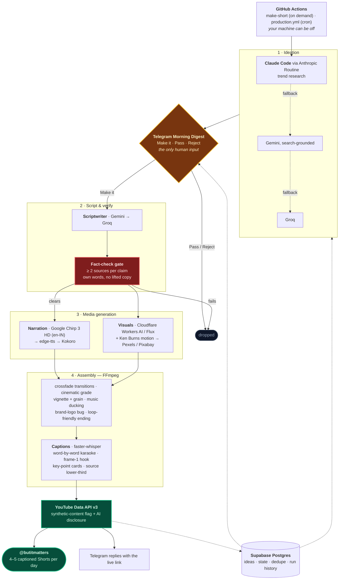

# 🎬 AI Reel Factory: **But It Matters**

**Channel:** *But It Matters*, daily impact news/info explainers (India + world).
**Live:** publishing captioned Shorts to **[@butitmatters](https://youtube.com/@butitmatters)**.

A near-zero-cost autonomous system that researches the news, writes scripts, narrates in a
near-human voice, generates story-specific visuals, edits a polished captioned vertical video,
and publishes faceless Shorts, requiring **one human action per day**: approving 4–5 ideas via
a Telegram "Morning Digest."

> **Primary goal:** Reliably publish **4–5 automated, captioned YouTube Shorts per day.**
> Consistency beats sophistication. Don't chase perfection early.

---

## 🧭 Start here

1. **[CLAUDE.md](CLAUDE.md)** — operating rules for any agent working in this repo. **Read first.**
2. **[STATUS.md](STATUS.md)** — live build state (what's done, what's next, blockers).
3. **[CHANGELOG.md](CHANGELOG.md)**; what shipped, version by version.
4. The docs, in order:

| # | Doc | What it's for |
|---|-----|---------------|
| 1 | [docs/01-design-spec.md](docs/01-design-spec.md) | Architecture & decisions (the "why") |
| 2 | [docs/02-implementation-plan.md](docs/02-implementation-plan.md) | Phase-1 MVP build, step by step |
| 3 | [docs/03-setup-guide.md](docs/03-setup-guide.md) | Accounts + API keys to create **before** coding |
| 4 | [docs/04-free-tools-reference.md](docs/04-free-tools-reference.md) | Every free tool, its limits, links |
| 5 | [docs/05-content-system.md](docs/05-content-system.md) | Templates + the hook database |
| 6 | [docs/06-roadmap.md](docs/06-roadmap.md) | The 5 phases from MVP to multi-niche scale |
| 7 | [docs/07-architecture-diagram.md](docs/07-architecture-diagram.md) | Visual system + data flow |
| 8 | [docs/08-news-niche-playbook.md](docs/08-news-niche-playbook.md) | **Niche compliance: non-negotiable** |

---

## ⚡ TL;DR: the stack

| Layer | Tool | Cost |
|-------|------|------|
| **Ideation (trend research)** | **Claude Code (Pro) via Anthropic Routine** | Pro sub |
| Ideation fallback | Gemini (search-grounded) → Groq | Free |
| Orchestration | GitHub Actions (on-demand + cron) + Routines | Free |
| Database/state | Supabase Postgres | Free |
| Approval UI | Telegram Bot (Make-it / Pass / Reject) | Free |
| Scripts | Gemini API (Groq failover) | Free |
| **Narration** | **Google Chirp 3 HD** → edge-tts (en-IN) → Kokoro | ≤ $5/mo cap (free at our volume) |
| **Visuals** | **AI B-roll: Cloudflare Workers AI / Flux + Ken Burns** → Pexels/Pixabay stock | Free |
| **Video edit** | FFmpeg: crossfade transitions · cinematic grade · vignette/grain · **music ducking** · **brand-logo bug** · loop-friendly endings | Free |
| Captions | faster-whisper: word-by-word karaoke + frame-1 hook + key-point cards + **source lower-third** | Free |
| Publishing | YouTube Data API v3 (synthetic-content flag + disclosure) | Free |

**Cost target:** **≤ $5/month** beyond the existing Claude Pro subscription (realized spend is
effectively $0; Google Cloud TTS and Cloudflare AI both sit inside free tiers at our volume).

---

## ✅ Current status: **Phase-1 MVP complete & publishing live**

See [STATUS.md](STATUS.md) for live detail; latest release notes in [CHANGELOG.md](CHANGELOG.md).

- [x] Full pipeline **built, tested, and publishing** captioned Shorts to **@butitmatters**
- [x] Every module done + tested in isolation; **313 tests** (config · db · llm · ideation · approval · scriptwriter · factcheck · voice · visuals · assembly · subtitles · publish · orchestrator)
- [x] All credentials collected & verified (Gemini · Groq · Supabase · Telegram · Pexels · Cloudflare · Google TTS · YouTube OAuth)
- [x] **Near-human voice** — Google Chirp 3 HD (en-IN), graceful fallback chain
- [x] **Story-specific AI B-roll** — Cloudflare Flux images + Ken Burns motion
- [x] **Premium auto-editing** — crossfade transitions, cinematic grade, music ducking, brand-logo bug, loop-friendly endings
- [x] **News-niche compliance** — ≥2 sources/claim, on-screen source citation, AI-disclosure + synthetic-content flag, CC0/own-words
- [x] **On-demand operation**; trigger the `make-short` workflow → ideas → Telegram digest → approve → render → published link

---

## 🗺️ The pipeline

One human action per day. Everything either side of the tap is automated, and every
external call has a fallback beneath it, which is how the whole thing stays inside free tiers.

Render artifacts are created in the cloud, uploaded, then deleted; nothing is stored (asset policy, rule 15).

---

## 🚀 How it runs (on-demand)

The primary trigger is the **`make-short`** GitHub Actions workflow (machine can be off):

1. **Run workflow** (GitHub web/mobile) → it proposes fresh ideas.
2. They arrive in **Telegram** with **Make-it / Pass / Reject** buttons.
3. Tap to approve → the cloud renders the polished, captioned reel and **replies with the YouTube link**.

A scheduled cron path (`production.yml`) remains available but optional. Render artifacts are
created in the cloud, uploaded, then deleted, never stored (asset policy, rule 15).
